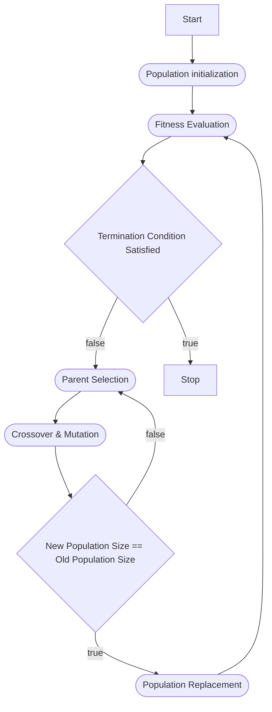
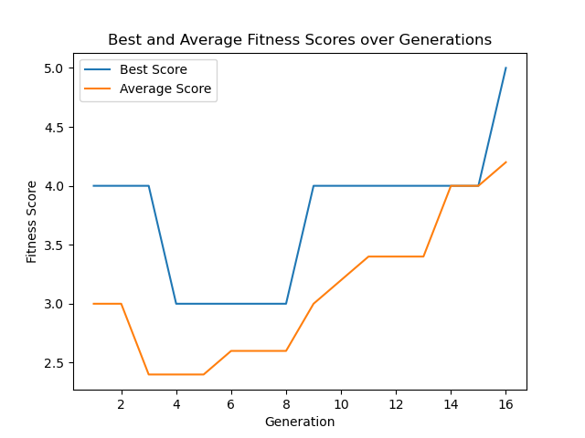

This post is a introduction to genetic algorithms. I will describe what is the genetic algorithm, all the basic concepts around that topic and what are the steps required for such an algorithm to work, lastly an example implementation in Python will be shown.

# What Is a Genetic Algorithm?

The genetic algorithm (GA) is a heuristic method that can find the optimal solution for the problem quickly. The whole concept of such method is to simulate the natural process of genetics evolution leveraging mechanisms known in the real world from the genetics. Mechanisms such as **mutation** and **crossover** (mating of parents) are the key building blocks of the genetic algorithm. In the GA the same as in nature, the problem is represented as chromosomes, and each of the chromosomes consists of genes. They can mutate and cross with each other, leading to discovery of new solutions. The important part is the proper representation of the problem as a chromosome, as with a wrong representation, the algorithm might have a problem with finding any solution. To summarize, even though the name itself implies some complex process, the actual how to is rather simple, as we will see the implementation.

# Why Use Genetic Algorithms?

- Great for optimization purposes.
- Handle well complex and nonlinear data.
- Work in "parallel" by testing in one **generation** (current population) several
  possible solutions.
- They can be adapted to handle different scenarios, as long as the problem
  can be represented as a chromosome.
- Relatively quick convergence time by employing heuristics that look for the optimal solution.

# Basic Workflow



As you can see in the above diagram, besides population initialization the genetic algorithm consists of a few steps that are being executed in a loop until a solution is found. Before I describe each of the steps, I also need to describe
what the population is. The **population** is a set of chromosomes where each of
them represents a possible solution, it can be seen as a state of the algorithm. To explain all the concepts I will be using an example problem of maximization of the sum of binary digits, which can be solved with generic algorithm. Consider the example of string **10110** that has a sum of 3 (1+0+1+1+0), as the algorithm progresses through each cycle, its goal will be to have a higher possible sum, in this case, 5 (**11111**).

## Population Initialization

This step is executed only once and is responsible for the creation of the initial chromosomes that will be evaluated. There are several ways that the
initial population can be created, yet random is most commonly used. In more complex problems it is possible to come up with heuristics that will initialize
the population in a way that will make the algorithm find the solution quicker, but here for simplification we skip that part. As part of the initialization, we also need to decide on the population size.

In our example, we will define the initial population as five chromosomes using random initialization.

```
00101
11100
10101
01011
11010
```

## Fitness Evaluation

Is a step that is executed for each chromosome in the population and is done with the help of fitness function. The function models how "good" the
solution is and assigns a fitness score to each chromosome. There is no single answer to how fitness function should look like, typically it will be an encoded version of the solution, so depending on the problem to solve it will be entirely different.

In our case fitness function will be just the sum of 1 in the chromosome string.

```
00101 -> fitness = 2
11100 -> fitness = 3
10101 -> fitness = 3
01011 -> fitness = 3
11010 -> fitness = 3
```

## Termination Condition

Depending on the problem, a stop can be implemented, at least in several different ways. The first one is the easiest, so to define a number of generations (loops) for the algorithm to execute, and stop as soon as the last generation is generated. In this case the best solution will be just the most fit chromosome from the last population. This is of course far for ideal, since it is quite possible that the algorithm will converge quicker, so the second idea for termination condition is to stop when all chromosomes are the same. Lastlu, we can also stop when the best solution is found, i.e. when the fitness score reaches the target value. Unfortunately in this case we would need to know the targe solution before we start the algorithm, which is not always the case.

In our example, we will stop when the sum of 1s of one of the chromosomes equals 5.

## Parent Selection

This stage is responsible for selecting the parents who will breed the offspring. There are a lot of methods to do so, yet to keep things simple I will describe just two of them. The first one is roulette wheel selection in this case, the probability of an individual being selected is equal to fitness. The second method is tournament selection, where two individuals are randomly selected from the whole population and the one with the higher score wins.

In the case of our maximization problem I will stick to the roulette wheel selection, we will select **11100** and **01011**.

## Crossover

Also called recombination is used for combining parents in such a way that it will create offspring that possess certain characteristics from parents yet make offspring a little bit different. Once again there are a lot of ways that this step can be executed yet in this article I will just mention two most popular ones so single and two-point crossover. Single-point crossover randomly selects one point in parent chromosomes on which the cut is made which creates two heads and two tails. In next step each tail is swapped between parents. On the other hand in two-point crossover, parent chromosomes are regarded as loop. Two random cut points are selected which splits the loop into two offspring chromosome.

Since single point crossover is by far most frequently used, we will use it in our case. We randomly select a cut point, let’s say 2.

- First parent: **11|100**
- Second parent: **01|011**
- First offspring: **11011**
- Second offspring: **01100**

## Mutation

It is applied with a low probability to ensure that other solutions that otherwise would end up unexplored are considered. This trick helps the algorithm avoid local maxima and explore other areas of the search space. It works on a single gene from a chromosome, usually just swapping it for another value within valid range. There are several methods of how this can be implemented, yet the most common is just randomly selecting a gene to change and swap it to the next correct value.

This is the method that we will leverage in our case, so let's swap the fourth bit of **01100** to get **01110**.

## New Population

We continue steps of parent selection, crossover, and mutation until we get a new population that the size equals to the previous one. An example of a new population might look like following:

```
11011
01110
01011
11010
11100
```

## Population Replacement

Lastly, this step decides which individuals in the current generation will be replaced by offspring from the new generation. There is once again a lot of ways to achieve it, but I will just explain two of them. The simplest possible solution is generational replacement, which on each of the algorithm loop replaces the old population with a new one. This has its consequences as better-suited individuals from the old generation can be lost. Opposed to it there is an elitism replacement method, that keeps N of the best-performing individuals and replaces all the others.

For our example, we will stick with generational replacement as it is easier to implement.

## Repeat Until Stop

Now we just repeat all the steps beginning with fitness evaluation until a solution is found. Examples of multiple generations can look as follows.

- First Generation

```
Population: 00101, 11100, 10101, 01011, 11010
Fitness:    2, 3, 3, 3, 3
```

- Second Generation

```
Population: 11011, 01110, 01011, 11010, 11100
Fitness:    2, 4, 3, 3, 3
```

- Third Generation

```
Population: 11101, 11111, 11100, 11010, 11101
Fitness:    4, 5, 3, 3, 4
```

# Example Solution Implementation

That's it with the theoretical part of genetics algorithms, and now is the time to implement a real-world working example, that will find a solution to our binary digit sum maximization problem. Below you can find a code listing with full Python implementation, it has max iterations set to 100, so in case of
no solution being found, the algorithm will stop automatically. Additionally, there is an early stop mechanism implemented so that in case of a sum equal to five (solution found) the algorithm will stop.

On each generation, we print out each chromosome's values, and in the case of an optimal solution being found it is announced in a console together with the number of generations needed. Additionally, plotting of average and best individuals across all generations is implemented.

```python
import random
import matplotlib.pyplot as plt

random.seed(10)   # Set random seed for reproducibility

# Genetic Algorithm parameters
POPULATION_SIZE = 5
GENE_LENGTH = 5  # Length of binary strings
MUTATION_RATE = 0.1  # Probability of mutation
GENERATIONS = 100  # Number of generations to evolve

# Generate random population of binary strings
def initialize_population(size, gene_length):
    return [[random.randint(0, 1) for _ in range(gene_length)] for _ in range(size)]

# Fitness function: Sum of the binary digits
def fitness(individual):
    return sum(individual)

# Roulette wheel selection: Select individuals based on their fitness
def selection(population, fitness_values):
    # Normalize fitness scores to 0-1 probability range to establish selection weights
    selection_weights = [chromosome_score / sum(fitness_values) for chromosome_score in fitness_values]

    # Random selection from population given the weights
    parents = random.choices(population, weights=selection_weights, k=2)

    return parents

# Single-point crossover
def crossover(parent1, parent2):
    point = random.randint(1, GENE_LENGTH - 1)  # Choose crossover point
    offspring1 = parent1[:point] + parent2[point:]
    offspring2 = parent2[:point] + parent1[point:]
    return offspring1, offspring2

# Mutation: Flip a random bit with a given probability
def mutate(individual):
    if random.random() < MUTATION_RATE:
        point = random.randint(0, GENE_LENGTH - 1)
        individual[point] = 1 - individual[point]  # Flip the bit (0 -> 1, 1 -> 0)
    return individual

# Genetic Algorithm
def genetic_algorithm():
    population = initialize_population(POPULATION_SIZE, GENE_LENGTH)
    best_scores = []
    average_scores = []

    for generation in range(GENERATIONS):
        # Calculate fitness for each individual
        fitness_values = [fitness(individual) for individual in population]

        # Record best and average fitness
        best_scores.append(max(fitness_values))
        average_scores.append(sum(fitness_values) / POPULATION_SIZE)

        # Print current generation's population and fitness
        print(f"Generation {generation + 1}:")
        for individual, fit_value in zip(population, fitness_values):
            print(f"Individual: {individual}, Fitness: {fit_value}")

        # Select parents and generate offspring through crossover
        new_population = []
        while len(new_population) < POPULATION_SIZE:
            parent1, parent2 = selection(population, fitness_values)
            offspring1, offspring2 = crossover(parent1, parent2)
            new_population.extend([mutate(offspring1), mutate(offspring2)])

        # Replace the old population with the new one
        population = new_population[:POPULATION_SIZE]

        # Check if the optimal solution has been found
        if max(fitness_values) == GENE_LENGTH:
            print(f"Optimal solution found in generation {generation + 1}!")
            break

    # Plot the results
    plt.plot(range(1, len(best_scores) + 1), best_scores, label="Best Score")
    plt.plot(range(1, len(average_scores) + 1), average_scores, label="Average Score")
    plt.xlabel('Generation')
    plt.ylabel('Fitness Score')
    plt.title('Best and Average Fitness Scores over Generations')
    plt.legend()
    plt.show()

    # Return the final population
    return population

# Run the genetic algorithm
final_population = genetic_algorithm()
print("Final Population:", final_population)
```

Listing output:

```
Generation 1:
Individual: [0, 1, 1, 0, 0], Fitness: 2
Individual: [1, 1, 1, 0, 0], Fitness: 3
Individual: [1, 1, 0, 0, 1], Fitness: 3
Individual: [0, 1, 0, 1, 1], Fitness: 3
Individual: [1, 1, 1, 1, 0], Fitness: 4

Generation 2:
Individual: [0, 1, 0, 1, 1], Fitness: 3
Individual: [0, 1, 0, 1, 1], Fitness: 3
Individual: [0, 1, 1, 0, 1], Fitness: 3
Individual: [1, 1, 0, 0, 0], Fitness: 2
Individual: [1, 1, 1, 1, 0], Fitness: 4

Generation 3:
Individual: [1, 1, 0, 0, 0], Fitness: 2
Individual: [0, 1, 1, 0, 0], Fitness: 2
Individual: [0, 1, 1, 0, 0], Fitness: 2
Individual: [1, 1, 0, 1, 1], Fitness: 4
Individual: [1, 1, 0, 0, 0], Fitness: 2

Generation 4:
Individual: [0, 1, 0, 1, 1], Fitness: 3
Individual: [1, 1, 1, 0, 0], Fitness: 3
Individual: [0, 1, 0, 0, 0], Fitness: 1
Individual: [1, 1, 1, 0, 0], Fitness: 3
Individual: [0, 1, 1, 0, 0], Fitness: 2

Generation 5:
Individual: [0, 1, 1, 0, 0], Fitness: 2
Individual: [1, 1, 1, 0, 0], Fitness: 3
Individual: [1, 1, 1, 0, 0], Fitness: 3
Individual: [1, 1, 1, 0, 0], Fitness: 3
Individual: [0, 1, 0, 0, 0], Fitness: 1

Generation 6:
Individual: [0, 1, 1, 0, 0], Fitness: 2
Individual: [1, 1, 1, 0, 0], Fitness: 3
Individual: [1, 1, 1, 0, 0], Fitness: 3
Individual: [1, 1, 1, 0, 0], Fitness: 3
Individual: [0, 1, 1, 0, 0], Fitness: 2

Generation 7:
Individual: [1, 1, 1, 0, 0], Fitness: 3
Individual: [1, 1, 1, 0, 0], Fitness: 3
Individual: [1, 1, 1, 0, 0], Fitness: 3
Individual: [0, 1, 1, 0, 0], Fitness: 2
Individual: [0, 1, 1, 0, 0], Fitness: 2

Generation 8:
Individual: [0, 1, 1, 0, 0], Fitness: 2
Individual: [0, 1, 1, 0, 0], Fitness: 2
Individual: [1, 1, 1, 0, 0], Fitness: 3
Individual: [1, 1, 1, 0, 0], Fitness: 3
Individual: [1, 1, 1, 0, 0], Fitness: 3

Generation 9:
Individual: [1, 1, 1, 0, 0], Fitness: 3
Individual: [0, 1, 1, 0, 0], Fitness: 2
Individual: [1, 1, 1, 0, 0], Fitness: 3
Individual: [1, 1, 1, 0, 1], Fitness: 4
Individual: [1, 1, 1, 0, 0], Fitness: 3

Generation 10:
Individual: [1, 1, 1, 0, 0], Fitness: 3
Individual: [1, 1, 1, 0, 0], Fitness: 3
Individual: [1, 1, 1, 0, 0], Fitness: 3
Individual: [1, 1, 1, 0, 1], Fitness: 4
Individual: [1, 1, 1, 0, 0], Fitness: 3

Generation 11:
Individual: [1, 1, 1, 0, 1], Fitness: 4
Individual: [1, 1, 1, 0, 0], Fitness: 3
Individual: [1, 1, 1, 0, 1], Fitness: 4
Individual: [1, 1, 1, 0, 0], Fitness: 3
Individual: [1, 1, 1, 0, 0], Fitness: 3

Generation 12:
Individual: [1, 1, 1, 0, 1], Fitness: 4
Individual: [1, 1, 1, 0, 0], Fitness: 3
Individual: [1, 1, 1, 0, 1], Fitness: 4
Individual: [1, 1, 1, 0, 0], Fitness: 3
Individual: [1, 1, 1, 0, 0], Fitness: 3

Generation 13:
Individual: [1, 1, 1, 0, 1], Fitness: 4
Individual: [1, 1, 1, 0, 1], Fitness: 4
Individual: [1, 1, 1, 0, 0], Fitness: 3
Individual: [1, 1, 0, 0, 0], Fitness: 2
Individual: [1, 1, 1, 1, 0], Fitness: 4

Generation 14:
Individual: [1, 1, 1, 0, 1], Fitness: 4
Individual: [1, 1, 1, 0, 1], Fitness: 4
Individual: [1, 1, 1, 0, 1], Fitness: 4
Individual: [1, 1, 1, 1, 0], Fitness: 4
Individual: [1, 1, 1, 0, 1], Fitness: 4

Generation 15:
Individual: [1, 1, 1, 0, 1], Fitness: 4
Individual: [1, 1, 1, 0, 1], Fitness: 4
Individual: [1, 1, 1, 0, 1], Fitness: 4
Individual: [1, 1, 1, 0, 1], Fitness: 4
Individual: [1, 1, 1, 0, 1], Fitness: 4

Generation 16:
Individual: [1, 1, 1, 1, 1], Fitness: 5
Individual: [1, 1, 1, 0, 1], Fitness: 4
Individual: [1, 1, 1, 0, 1], Fitness: 4
Individual: [1, 1, 1, 0, 1], Fitness: 4
Individual: [1, 1, 1, 0, 1], Fitness: 4
Optimal solution found in generation 16!
```



# Conclusions

To conclude, in this article I presented a concept of genetic algorithms that are part of large family of machine learning algorithms. They offer a powerful and flexible approach, that can be utilized in various optimization, search, and combinatorics problems.
